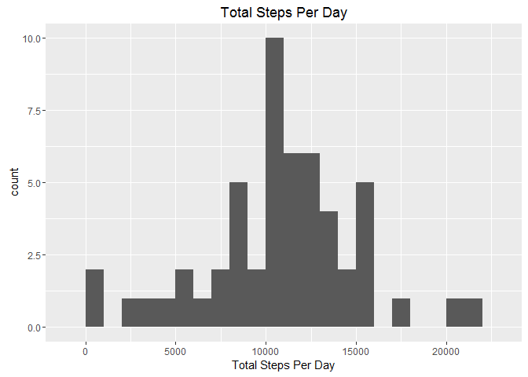
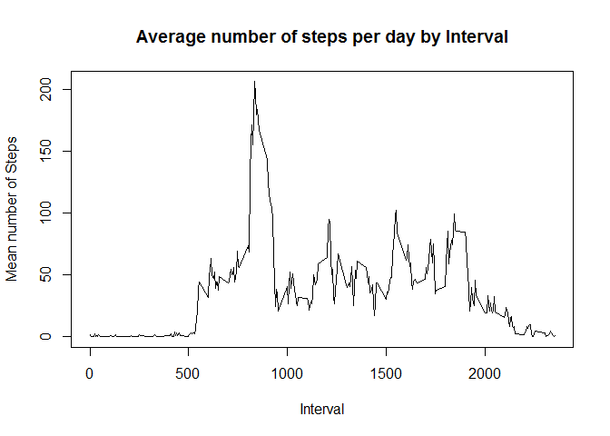
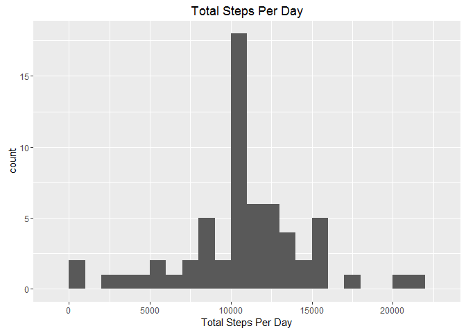

#Alison's Project 1 Report


```r
        library(ggplot2)
        library(dplyr)
```

```
## 
## Attaching package: 'dplyr'
```

```
## The following objects are masked from 'package:stats':
## 
##     filter, lag
```

```
## The following objects are masked from 'package:base':
## 
##     intersect, setdiff, setequal, union
```

```r
        library(lattice)
        
        ##read the data into a dataframe dat
        dat <- read.csv("activity.csv", stringsAsFactors = FALSE)
        
        ##convert the date variable into a date type
        dat$date <- as.Date(dat$date, "%Y-%m-%d")
        
        ##calculate the total number of steps taken
        totsteps <- sum(dat$steps, na.rm = TRUE)
```

There were **570608** total steps taken in the dataset.


```r
        ##calculate the total steps per day
        
        s <- split(dat, dat$date)
        stepsday <- sapply(s, function(x) sum(x[,"steps"]))
        
        ##use this data to plot a histogram of total steps per day
        qplot(stepsday, xlab="Total Steps Per Day", main="Total Steps Per Day", binwidth=1000)
```

```
## Warning: Removed 8 rows containing non-finite values (stat_bin).
```

\


```r
        ##calculate the mean and median of the total steps per day
        tsmean <- as.integer(mean(stepsday, na.rm=TRUE))
        tsmedian <- median(stepsday, na.rm=TRUE)
```

The mean of the total steps per day is: **10766**
The median of the total steps per day is: **10765**


```r
        ##calculate the mean steps by interval over all time
        mytab <- summarise(group_by(dat,interval), mean(steps, na.rm=TRUE))
        names(mytab) <- c("interval", "mean.steps")
        ##make the plot of Average number of steps by interval
        plot(mytab$interval, mytab$mean.steps, type="l", ylab = "Mean number of Steps", 
             xlab="Interval", main="Average number of steps per day by Interval")
```

\


```r
        ##find the maximum value of the average number of steps
        mymax <- max(mytab$mean.steps)
        ##find the row containing this max
        myrow <- filter(mytab, mean.steps == mymax)
        ##hence find the interval containing the maximum number of steps
        myint <- myrow[,1]
```

The interval containing the maximum number of steps is: **835**

##Missing Values


```r
        ##calculate the number of rows with some NAs in them
        badrows <- nrow(dat) - sum(complete.cases(dat))
```

There are **2304** rows containing NAs

###Strategy for Addressing Missing Values

My strategy for addressing missing values is to populate the NAs with the mean for that interval.


```r
        ##replace the missing values in steps variable with the mean number of steps for that interval
        ##we will use mytab from above to lookup the mean values per interval
        dat2 <- dat
                for (i in seq_len(nrow(dat))) {
                        if (is.na(dat[i,"steps"])) { 
                                dat2[i,"steps"] <- mytab[(mytab$interval==dat[i,"interval"]),2]
                        }     
                }
```

Plot another histogram as per the start of the report but now using the dataset with the missing values imputed with interval means.


```r
        ##calculate the total steps per day
        
        s2 <- split(dat2, dat2$date)
        stepsday2 <- sapply(s2, function(z) sum(z[,"steps"]))
        
        ##use this data to plot a histogram of total steps per day
        qplot(stepsday2, xlab="Total Steps Per Day", main="Total Steps Per Day", binwidth=1000) 
```

\

```r
        ##calculate the mean and median of the total steps per day
        tsmean2 <- as.integer(mean(stepsday2, na.rm=TRUE))
        tsmedian2 <- as.integer(median(stepsday2, na.rm=TRUE))
```

By comparing the two histograms we can see that the total steps per day increases at around the 1200 steps mark in the imputed dataset.

The new mean is 10766 and is the same as the new median 10766. Both of these are the same as the original mean. This is not surprising, perhaps, as we have used mean to populate missing values. The new median is a litte higher than the original median.

##Weekdays versus weekends


```r
        ##decide the day of the week each date is
        myday <- weekdays(dat2$date)
        ##replace the days with either weekday or weekend as appropriate
        for (i in 1:length(myday)) {
                if (myday[i] == "Saturday" | myday[i] == "Sunday") {
                        myday[i] <- "weekend"       
                }
                else {
                        myday[i] <- "weekday"
                }
                i <- i + 1
        }
        
##now bind this vector as a column to dat2
        dat2 <- cbind(dat2, myday)
        
        ##make a dataframe containing the mean steps per interval for all days dependent on weekday
        ##and weekend
        mytab3 <- summarise(group_by(dat2,interval, myday), mean(steps, na.rm=TRUE))
        names(mytab3) <- c("interval", "myday", "meansteps")
        ##build the lattice plot to show weekday versus weekend
        xyplot(meansteps ~ interval | myday, data = mytab3, type = "l", 
               ylab = "Number of Steps", layout = c(1,2))
```

\


